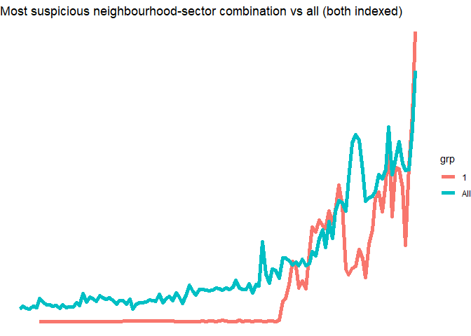

Change Detection Ensemble Modeling for Suspicious Transactions
================
William Au
June 5, 2021

## Introduction

As part of the Data for Good (Calgary chapter) / GeoWomen YYC’s
Datathon, participants chose data projects with an Economic, Social and
Corporate Governance (ESG) focus using public data. This project
represents my individual contribution, a project that implements a
change detection ensemble model on suspicious transactions in order to
target geographical areas and activity sectors for organized financail
crime investigations.

The Financial Transactions and Reports Analysis Centre (FINTRAC) is
Canada’s regulator of proceeds of crime, such as money laundering,
bribery and terrorist financing. Regulated sectors, such as banks,
credit unions, casinos and insurance companies, must report certain
transactions to FINTRAC to enable their investigations and enforcement.
One such class of transactions are suspicious transactions, where the
regulated sector entity must file a “suspicious transaction report”
(STR) to FINTRAC whenever it suspects a particular transaction has a
higher probability of being a proceed of crime.

Through the Government of Canada’s Open Data portal, FINTRAC provides a
public data set of aggregate reports by neighbourhood, defined as Canada
Post’s Forward Sortation Area (FSA) and by sector, updated on a monthly
basis. This data set includes 4 types of transactions: STRs, Large Cash
Transaction Reports (LCTRs), Casino Disbursements (CDRs) and Electronic
Funds Transfer Reports (EFTs). This project focuses solely on STRs
because they are suspicious by nature, as opposed to the other types of
transactions which are reported on a business-rule basis. The CSV data
set is available for download here:
<https://open.canada.ca/data/en/dataset/81cc47ac-e88d-4b7f-9318-8774a2d919e6>.

## Motivation and Objective

The motivation for implementing a change detection model is for 3
reasons:

  - Financial crime is often organized. For example, criminals may
    recruit “money mules” from vulnerable populations in certain areas,
    such as the homeless or drug addicts, to spread the risk of
    detection across multiple persons, often in a common geography.
    Another criminal strategy might involve “spamming” the financial
    system with criminal transactions as fast as possible in order to
    maximize their profits before detection and remediation.
  - Alternative methods for targeting investigations can be very
    inefficient or biased. Statistical hypothesis testing may be one
    approach. However, when STRs become so high in number to become
    problematic with statistical significance, the time delay to
    detection may be quite long, allowing criminals to conduct their
    activities freely for longer. Sampling based approaches are another
    possibility, but these can be very inefficient as well since
    rare-event detection can be quite unlikely with sampling. Another
    important potential flaw would be human biases in investigations;
    relying heavily on human intuition may inadvertently lead to
    unconscious biases against vulnerable populations, or racial or
    income marginalized groups.
  - Social costs of organized financial crimes are enormous. In addition
    to the monetary fines and sanctions, there are economic and social
    harms as well. Canada’s financial system and the reputation of our
    companies can be harmed. More importantly, organized financial
    crimes often fund and perpetuate other criminal activities like
    human trafficking, illicit drugs or terrorist financing.

The objective of this project is to develop an change detection model to
efficiently target investigations on a geographical and sector basis.
This model must have these 5 critical success factors:

  - Must serve as a timely early-warning system, and not require long
    lags and delays before alerting
  - Must be able to be processed quickly and efficiently on commodity
    hardware with open source software
  - Must have low learner or model bias
  - Must have low human bias
  - Must have low data requirements (i.e., ideally no data sources
    outside of the FINTRAC-provided data set)

## Methodology

I model positive change detection at 2 grains: at the aggregate FSA and
at the FSA-sector combination. The model uses a unique implementation of
the cumulative sum (CUSUM) change detection algorithm. In CUSUM, the
formula is as below:

St = max(0, St-1 + (xt - mu - C)); with a change event if St \>= T

Note that St is the cumulative sum at time t, St-1 is the cumulative sum
at the previous time period, xt is the measured metric at time t, mu is
xt’s long-term average, C is a hyperparameter to buffer out random noise
and T is the threshold hyperparameter.

Traditional implementations of CUSUM often rely on intuition or
estimates of the cost of the change to set the hyperparameters C and T.
In this STR use-case, intuition may be sub-optimal because criminals
often act in novel ways that cannot be intuited, not to mention
intuition introduces the risk of human bias. Cost estimates may be
sub-optimal as well, because it can be very difficult and/or inaccurate
to estimate costs due to rare-event contagion, social costs, victim
costs, etc.

In my implementation, I leverage grid search over the entire search
space of C and T in an ensemble manner. After each iteration of CUSUM
within the grid, the model saves the FSAs or the FSA-sector combinations
that have St \>= T but have St-1 \< T (i.e., new change event in the
most recent reporting period for rapid detection). And after the grid
search is completed, the model counts all the occurances of FSAs or
FSA-sector combinations as a “vote” to determine the most likely STR
anomalies.

## Exploratory Data Analysis

As the plot below shows, the aggregate number of STRs increases over
time at an increasing rate. There is fairly large spikes in 2019 and
2021.

<!-- -->

The plot below shows STRs over time for each activity sector, with the
following insights:

  - Banks, credit unions and trusts show increases over time in both
    mean STRs and its variance, the former 2 sectors at an increasing
    rate
  - Precious metals show mean decreases over time
  - Real estate have shown a very recent spike
  - Securities variance has decreased dramatically
  - Money services has not changed much over time

<!-- -->

The plot below shows the same data, but stacked. This view shows that
banks and money services dwarf the other sectors in total STRs, by far.

<!-- -->

The stacked percentage view also shows interesting insights. Not only
are banks and money services the biggest senders of STRs, but over time
banks and money services became far bigger and far smaller in proportion
of STRs, respectively.

Banks have the biggest, most dramatic change to their STR profile over
the entire time-series, particularly after 2014. During this time, there
was a large money-laundering case in Canada involving Manulife. Manulife
was levied a large fine and this case received international news
coverage. This event created a lot of scrutiny towards the bank sector,
likely leading to bankers becoming far more risk adverse and submitting
more STRs to minimize their regulatory and operational risks. Note that
there is no penalty in submitting false-positive STRs in good faith.

<!-- -->

## FSA Model

The first implementation of the ensemble CUSUM model is at an FSA-level,
regardless of sector. The voting outcome of the ensemble is depicted in
the histogram and violin jitter plots below. Note that each of the
\>1,000 FSAs is scored almost 500 times each, for a total of over half a
million iterations.

<!-- --><!-- -->

The above 2 plots show that only a few FSAs are anomalies in the most
recent reporting month. By ordering the ensemble results and plotting
the total votes versus this order, I look for a cut-off point on the
elbow plot below as another way to determine the change cut-off, which I
set at 2 FSAs.

<!-- -->

So which are the neighbourhoods with the most suspicious recent spikes
in STRs? Here they are below:

    ## # A tibble: 2 x 3
    ##   pc    Neighbourhood                                              order
    ##   <chr> <chr>                                                      <int>
    ## 1 M1K   Scaborough (Kennedy Park / Ionview / East Birchmount Park)     1
    ## 2 M8X   Etobicoke (Kingsway / Montgomery Rd / Old Mill North           2

## FSA-Sector

Similar to the FSA-level model, I implement ensemble CUSUM at the
FSA-sector level, which is likely a more useful tool for investigation
given the lower level of targeting. Across all combinations of FSA,
sector and increments in the grid space of C and T, this model is
trained on almost 4 million iterations. Similar interpretation to the
FSA-level implementation, the violin jitter plot shows 1 very distinct
anomaly in the bank sector.

<!-- -->

So which is this suspicious FSA-sector combination in the bank sector?
Here it is:

    ## # A tibble: 1 x 4
    ##   pc    sector Neighbourhood                                               order
    ##   <chr> <chr>  <chr>                                                       <int>
    ## 1 M1K   BANK   Scarborough (Kennedy Park / Ionview / East Birchmount Park)     1

## Model Validation

Since the data is not labeled, traditional model validation techniques
could not be used. Instead, I use a “litmus” test by creating
time-series visualizations of the change detection anomalies to ensure
the most recent observation appears consistent with a positive change
event, relative to the overall data set. Below are the results, and all
of them are defensible as strong candidates for targeted investigations:

<!-- --><!-- -->

Interestingly, the above plots show that the FSA-level model alerts at
much higher levels relative to the finer grain FSA-sector model. I would
have expected the reverse, since the finer gain is likely to be more
sensitive to changes in STR volumes. If I was a member of FINTRAC or
some other enforcement agency, I would investigate the reasons behind
this, which may be something systemic or purely coincidental, but may
also be because of criminals adopting strategies to spread their
transactions across multiple sectors in an attempt to evade detection.

## Potential for Future Applications and Benefits

FINTRAC, as well as other agencies tasked with financial crimes (e.g.,
CSIS, RCMP), could leverage this methodology and expand it to suit their
investigative needs and lower-level data. Possible implementations could
include (list is not mutually exclusive or exhaustive):

  - Reporting on lower-level geographies, such as postal walk or
    micro-neighbourhood to match their scope of investigations
  - Detecting changes in aggregate STRs where organized financial crime
    may be more probable to arise, such as by relevant
    filters/dimensions that are available in STR form fields (e.g.,
    conductors, beneficiaries, holders, owners, directors/officers,
    relationships, transaction type, dollar amount thresholds)
  - Creating new metrics for change detection by data transformations
    (e.g., STR:total transaction ratio, adding STRs with LCTRs, CDRs
    and/or EFTs)
  - Outputting change events with their relevant data fields (e.g.,
    pre/post change levels, conductors, dollar amounts, neighbourhoods)
    to rank the change events by investigative priority and/or to assign
    to investigation team
  - Using model output to create reports for investigators in the field
    as a job aid

A successful implementation of ensemble CUSUM can bring a number of
benefits, such as (again, list is not mutually exclusive or exhaustive):

  - Improved cost, time and/or resource efficiency for investigations
  - Reduced human bias in investigation selection, including potentially
    unconscious bias in ethnic or marginalized income neighbourhoods
  - Mitigated social and economic harm due to the ability to detect and
    stop criminal activity earlier
