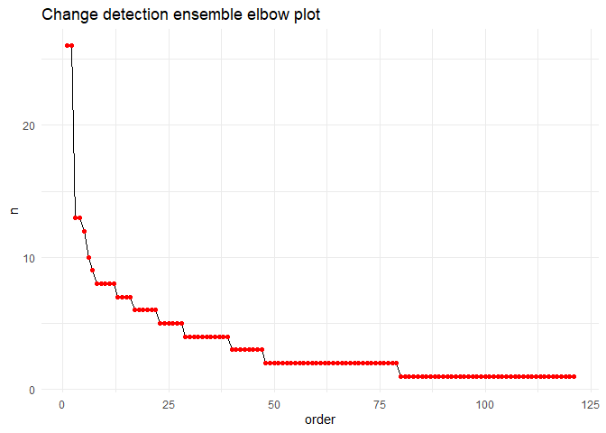
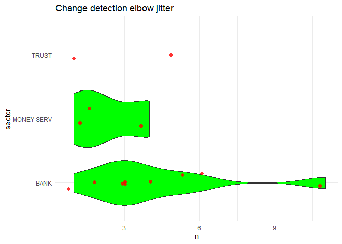

Change Detection Ensemble Modeling for Suspicious Transactions
================
William Au
June 5, 2021

## Introduction

As part of the Data for Good (Calgary chapter) / GeoWomen YYC’s
Datathon, participants chose data projects with an ESG focus using
public data. This project represents my individual contribution, a
project that implements a change detection ensemble model on suspicious
transactions in order to target geographical areas and activity sectors
for investigations.

The Financial Transactions and Reports Analysis Centre (FINTRAC) is
Canada’s regulator of proceeds of crime, such as money laundering,
bribery and terrorist financing. Regulated sectors, such as banks,
credit unions and insurance companies, must report certain transactions
to FINTRAC to enable their investigations and enforcement. One such
class of transactions are suspicious transactions, where the regulated
sector entity must file a “suspicious transaction report” (STR) to
FINTRAC whenever it suspects a particular transaction has a higher
probability of being a proceed of crime.

Through the Government of Canada’s Open Data portal, FINTRAC provides a
public data set of aggregate reports by neighbourhood, defined as Canada
Post’s Forward Sortation Area (FSA) and by sector, updated on a monthly
basis. This data set includes 3 classes of transactions: STRs, Large
Cash Transaction Reports (LCTRs) and Electronic Funds Transfer Reports
(EFTs).

## Motivation and Objective

The motivation for implementing a change detection model is for 2
reasons:

  - Financial crime is often organized. For example, criminals may
    recruit “money mules” from vulnerable populations in certain areas
    to spread the risk of detection across multiple persons, often in a
    common geography. Another criminal strategy might involve spamming
    the financial system of criminal transactions to get as much value
    as quickly as possible before being detected.
  - Alternative methods for targeting investigations can be very
    inefficient. Statistical hypothesis testing may be one approach;
    however, when STRs get so large to become problematic with
    statistical significance, the time delay to detection may be quite
    long, allowing criminals to conduct their activities freely for
    longer. Sampling based approaches are another possibility, but these
    can be very inefficient as well since rare-event detection can be
    quite unlikely with sampling.

The objective of this is to develop an change detection model to
efficiently target investigations on a geographical and sector basis.
This model must have these characteristics:

  - Must serve as a timely early-warning system, and not require long
    lags and delays before alerting
  - Must be able to be processed efficiently on commodity hardware with
    open source software
  - Must have low learner bias
  - Must have low human bias
  - Must have low data requirements (i.e., ideally no data sources
    outside of the FINTRAC-provided data set)

## Methodology

I modeled positive change detection at 2 grains: at the aggregate FSA
and at the FSA-sector combination. The model uses a unique
implementation of the cumulative sum (CUSUM) change detection algorithm.
In CUSUM, the formula is as below:

St = max(0, St-1 + (xt - mu - C)); Change event if St \>= T

Note that St is the cumulative sum at time t, St-1 is the cumulative sum
at the previous time period, xt is the measured metric at time t, mu is
xt’s long-term average, C is a hyperparameter to buffer out random noise
and T is the threshold hyperparameter.

Traditional implementations of CUSUM often relies on intuition or
estimates of the cost of the change to set the hyperparameters C and T.
In the STR use-case, intuition may be sub-optimal because criminals
often act in novel ways, not to mention intuition introduces the risk of
human bias. Cost estimates may be sub-optimal as well, because it can be
very difficult and/or inaccurate to estimate costs due to rare-event
contagion, social costs, victim costs, etc.

In my implementation, I leverage grid search over the entire search
space of C and T in an ensemble manner. After each iteration of CUSUM
within the grid, the model saves the FSAs or the FSA-sector combinations
that have St \>= T. And after the grid search is completed, the model
counts all the occurences of FSAs or FSA-sector combinations as a “vote”
to determine the most likely STR anomalies.

## Exploratory Data Analysis

As the plot below shows, the aggregate number of STRs increases over
time at an increasing rate. There is fairly large spikes in 2019 and
2021.

<!-- -->

The plot below shows STRs over time for each activity sector, with the
following insights:

  - Banks, credit unions and trusts show increases over time in both
    STRs and the variance, the former 2 at an increasing rate
  - Precious metals show decreases over time
  - Real estate have shown a very recent spike
  - Securities variance has decreased dramatically
  - Money services has not changed much over time

<!-- -->

The plot below shows the same data, but stacked. This view shows have
banks and money services dwarf the other sectors in total STRs, by far.

<!-- -->

The stacked percentage view also shows interesting insights. Not only
are banks and money services the biggest senders of STRs, but over time
banks and money services became far bigger and far smaller in proportion
of STRs, respectively.

<!-- -->

## FSA Model

The first implementation of the ensemble CUSUM model is at an FSA-level
(i.e., regardless of sector). The voting outcome of the ensemble is
depicted in the histogram and violin jitter plots below (note that each
of the \>1000 FSAs is scored almost 500 times each, for a total of over
half a million iterations).

<!-- --><!-- -->

The above 2 plots show that only a few FSAs are anomalies in the most
recent reporting month. By ordering the ensemble results and plotting
the total votes versus this order, I look for a cut-off point on the
elbow plot below as another way to determine the change cut-off, which I
set at 2 FSAs.

<!-- -->

So which are the neighbourhoods with the most suspicious recent spikes
in STRs? Here they are below:

    ## # A tibble: 2 x 3
    ##   pc    Neighbourhood                                              order
    ##   <chr> <chr>                                                      <int>
    ## 1 M1K   Scaborough (Kennedy Park / Ionview / East Birchmount Park)     1
    ## 2 M8X   Etobicoke (Kingsway / Montgomery Rd / Old Mill North           2

## FSA-Sector

Similar to the FSA-level model, I implemented ensemble CUSUM at the
FSA-sector level, which is likely a more useful tool for investigation.
Across all combinations of FSA, sector and increments in the grid space
of C and T, this model is trained on almost 4 million iterations.
Similar interpretation to the FSA-level implementation, the violin
jitter plot shows 1 very distinct anomaly in the bank sector.

<!-- -->

So which is this suspicious FSA-sector combination in the bank sector?
Here it is:

    ## # A tibble: 1 x 4
    ##   pc    sector Neighbourhood order
    ##   <chr> <chr>  <chr>         <int>
    ## 1 M1K   BANK   UK                1

## Model Validation

Since the data is not labeled, traditional model validation techniques
could not be used. Instead, I use a “litmus” test by creating
time-series visualizations of the change detection anomalies to ensure
the most recent observation appears consistent with a positive change
event. Below are the results, and all of them are defensible as strong
candidates for targeted investigations:

<!-- --><!-- -->
