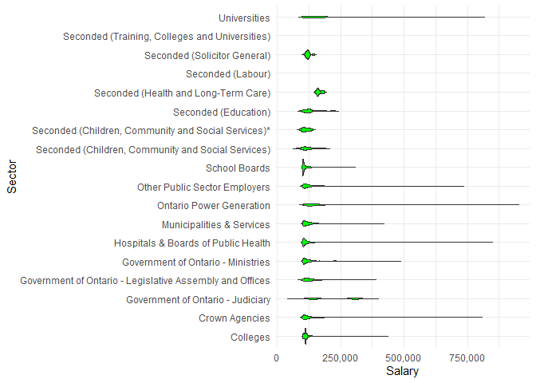
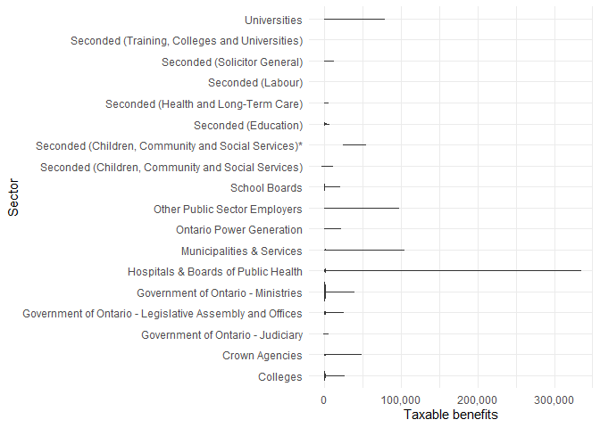
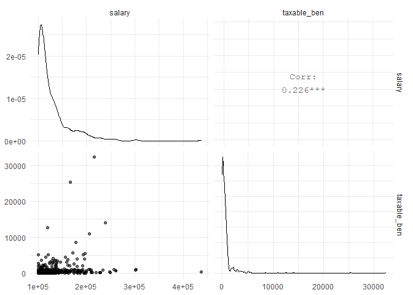
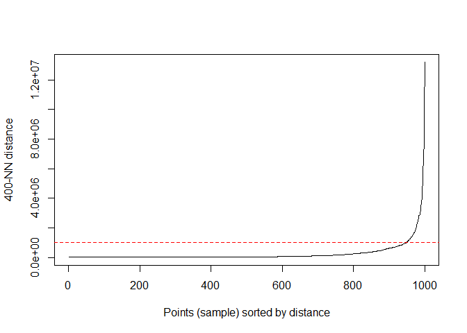
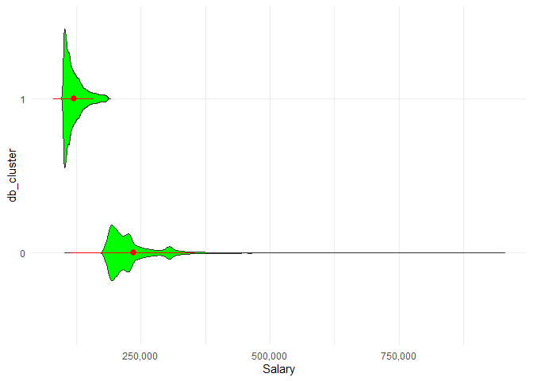
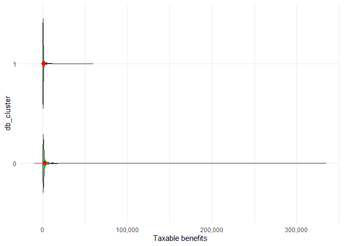
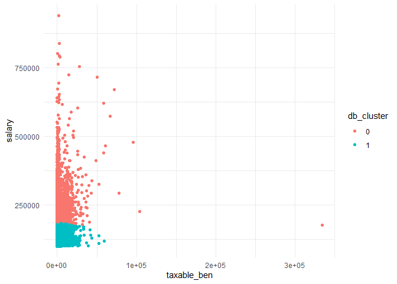
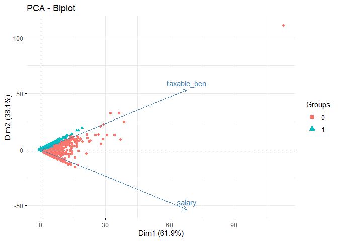
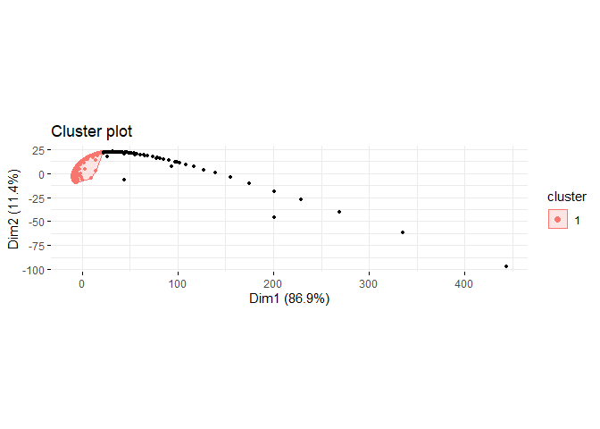

Anomaly Detection in Ontario’s 2019 Sunshine List
================
William Au
June 4, 2021

## Introduction

Each year, the Ontario government publishes its “Sunshine List” of
highest income earners among its public servants, which is defined as
those earning over $100,000 annually. This data is intended to
facilitate transparency and accountability.

Anomaly detection refers to techniques that detect outliers, rare
events, unusual data, etc. Using unsupervised machine learning
algorithms for anomaly detection is a common technique. In this project,
I use density-based spatial clustering of applications with noise
(DBSCAN) to detect anomalies in Ontario’s Sunshine List.

The motivation for anomaly detection on the List is for 3 reasons:

  - Uncover possible data entry errors, such as erroneously adding an
    extra digit to a salary
  - Discover instances of compensation that may be out-of-policy
  - Highlight possible instances of cronyism, nepotism or other
    politically corrupt compensation practices

DBSCAN is a non-parametric, and can detect anomalies even if they do not
cluster in a spherical shape or lie close to large numbers of
observations. Because of these advantages, it is an excellent technique
in this analysis because corrupt compensation practices might be
intentionally hidden, leading to non-spherical clusters or nearness to
non-anomalous clusters in high-dimensional data.

Below is the results of my exploratory data analysis. There are some
insights by sector, including:

  - The highest salaries are in Ontario Power Generation
  - Seconded and school board employees have generally lower salaries
  - University staff have generally higher salaries than colleges
  - Taxable benefits are often low, but can rarely be extremely high,
    especially for hospitals and public health boards
  - Taxable benefits is only 23% correlated with salary, which is lower
    than I expect

<!-- --><!-- --><!-- -->

Because DBSCAN is a memory-intensive algorithm, it could not be
implemented on the entire Sunshine List on commodity hardware. So I
build a heuristic using the more efficient k-means clustering algorithm,
assigning each public servant to one of 1,000 k-means cluster, a large
enough number such that anomalies should be grouped together but small
enough for processing on commodity hardware. Then DBSCAN was processed
on the reduced data set of 1,000 k-means clusters.

A popular method for hyperparameter tuning for DBSCAN was using a
k-nearest neighbour plot and varying k for the minimum number of members
in a cluster and interpreting the plots for an elbow point for a
hypothetical radius parameter. Because of the nature of the project, I
set the minimum number of observations per cluster as a low 1.

The plots below depict the final iteration of hyperparameter tuning
attempts (6 tuning attempts were attempted to discriminate between
anomalous and non-anomalous observations). For the final model, I noted
elbow points at radius parameters of 1,000,000 where the minimum number
of points per cluster is 400.

<!-- -->

The print below shows the distribution between anomalous (db\_cluster =
0) and non-anomalous clusters (db\_cluster = 1). The anomalies are about
6% of all public servants in the List.

    ## # A tibble: 2 x 2
    ## # Groups:   db_cluster [2]
    ##   db_cluster      n
    ##   <chr>       <int>
    ## 1 0           10439
    ## 2 1          156659

After modeling, the plots below show some insights between anomalous and
non-anomalous public servants:

  - Not only do the anomalies have almost universally higher salaries,
    but their highest salaries are orders of magnitude higher than the
    non-anomalous
  - Even in anomalies, taxable benefits are often low; however, the most
    extreme of these can be greater than $300,000 in a year
  - Anomalies are most often driven by higher salaries, as opposed to
    taxable benefits, but a very few number of anomalies have huge
    taxable benefits; a small number of anomalies also are driven by a
    combination of high salary and high taxable benefits

<!-- --><!-- --><!-- --><!-- --><!-- -->

So who were the top anomalies? Here are the top 10 by salary, taxable
benefits and a combination of the two.

    ## [1] "Top 10 public servants with the highest salaries"

    ## # A tibble: 10 x 6
    ##    Sector     `Last Name` `First Name` Employer       `Job Title`         salary
    ##    <chr>      <chr>       <chr>        <chr>          <chr>                <dbl>
    ##  1 Ontario P~ Lyash       Jeffrey      Ontario Power~ "President and Chi~ 9.39e5
    ##  2 Ontario P~ Hartwick    Kenneth      Ontario Power~ "President and Chi~ 9.30e5
    ##  3 Hospitals~ Smith       Kevin        University He~ "President and Chi~ 8.45e5
    ##  4 Ontario P~ Reiner      Dietmar E.   Ontario Power~ "Senior Vice Presi~ 8.37e5
    ##  5 Universit~ Smith       Daren        University Of~ "President and Chi~ 8.01e5
    ##  6 Crown Age~ Fuller      Mark         Ontario Publi~ "President and Chi~ 7.98e5
    ##  7 Ontario P~ Granville   Sean         Ontario Power~ "Deputy Chief Nucl~ 7.92e5
    ##  8 Ontario P~ Martelli    Mike         Ontario Power~ "President, Renewa~ 7.88e5
    ##  9 Crown Age~ Rigby       Stephen      Ontario Lotte~ "President and Chi~ 7.62e5
    ## 10 Hospitals~ Rutledge    Timothy      Unity Health ~ "President And Chi~ 7.54e5

    ## [1] "Top 10 public servants with the highest taxable benefits"

    ## # A tibble: 10 x 6
    ##    Sector     `Last Name` `First Name` Employer    `Job Title`       taxable_ben
    ##    <chr>      <chr>       <chr>        <chr>       <chr>                   <dbl>
    ##  1 Hospitals~ Apkon       Michael      The Hospit~ "Former Presiden~     333918.
    ##  2 Municipal~ Bhatnagar   Samir        City Of Ot~ "Inspector"           103673 
    ##  3 Municipal~ Zubyck      Shelly       City Of Te~ "Director of Cor~      97402.
    ##  4 Other Pub~ Gibson      Garth        Vector Ins~ "President and C~      96057 
    ##  5 Universit~ Tettey      Wisdom       University~ "Vice-President,~      77640.
    ##  6 Other Pub~ Habib       George       Ontario Lu~ "President and C~      73352.
    ##  7 Hospitals~ Zahn        Catherine    Centre For~ "President and C~      71607.
    ##  8 Hospitals~ Smith       Kevin        University~ "President and C~      70256.
    ##  9 Hospitals~ Cohn        Ronald       The Hospit~ "President and C~      66558.
    ## 10 Hospitals~ Skot        Janice       Royal Vict~ "President and C~      60808.

    ## [1] "Top 10 public servants with the highest combined compensation"

    ## # A tibble: 10 x 6
    ##    Sector    `Last Name` `First Name` Employer      `Job Title`       total_comp
    ##    <chr>     <chr>       <chr>        <chr>         <chr>                  <dbl>
    ##  1 Ontario ~ Lyash       Jeffrey      Ontario Powe~ "President and C~    940787.
    ##  2 Ontario ~ Hartwick    Kenneth      Ontario Powe~ "President and C~    936627.
    ##  3 Hospital~ Smith       Kevin        University H~ "President and C~    915248.
    ##  4 Ontario ~ Reiner      Dietmar E.   Ontario Powe~ "Senior Vice Pre~    839373.
    ##  5 Universi~ Smith       Daren        University O~ "President and C~    801110.
    ##  6 Crown Ag~ Fuller      Mark         Ontario Publ~ "President and C~    798238.
    ##  7 Ontario ~ Granville   Sean         Ontario Powe~ "Deputy Chief Nu~    794586.
    ##  8 Ontario ~ Martelli    Mike         Ontario Powe~ "President, Rene~    791164.
    ##  9 Hospital~ Rutledge    Timothy      Unity Health~ "President And C~    782181.
    ## 10 Hospital~ Smith       Andy         Sunnybrook H~ "President and C~    765169.
