Detecting Species Redundancy in Pokemon GO - Gotta Catch (Most of) ’Em
All
================
William Au
October 11, 2018

## Introduction

Pokemon GO is a mobile, location-based game where players can catch
Pokemon for purposes of battling gyms, raiding gyms, defending gyms,
trading or simply collecting. There are constraints such that a player
cannot own all combinations of Pokemon in a play-able state (i.e., in
their Pokemon box):

  - The Pokemon box has finite limit.
  - There are many species (currently, there are almost 400 species, but
    the game was launched with about 150).
  - Many Pokemon have shiny variants within the same species.
  - Many Pokemon have different or neutral gender within the same
    species.
  - The game occasionally launches “event” Pokemon that spawn during
    certain events and will appear differently (e.g., wearing a hat or
    sunglasses).
  - Pokemon of the same species usually have different “individual
    values”, which represent separate scores for attack, defense and
    stamina.

So the serious player must make choices with respect to which Pokemon to
keep in a live Pokemon box, and which to discard. The purpose of my
analysis was to use modeling and analytical techniques to see which
Pokemon species most closely mimic others in terms of non-esthetic
functionality; that is, if redundancy could be modeled between species,
then players could effectively make keep/discard decisions according to
their strategic objective.

## Methodology

Because I had no labeled data, my methodology consisted of using
unsupervised machine learning. The modeling algorithm selected was
density-based spatial clustering of applications with noise (DBSCAN)
because of its known high-performance in results even when clusters are
highly non-spherical (which was the case as depicted in the final
model’s cluster plot).

## Data Acquisition

My analysis was based on the initial launch of the game with about 150
species because data was not available for a larger set of more recent
species. I acquired two data sets:

  - From Kaggle, a data set with each Pokemon’s first type, second type,
    combat points (CP) and hit points (HP)
    (<https://www.kaggle.com/abcsds/pokemongo>)
  - From the game’s GamePress site, a spreadsheet with each Pokemon’s
    damage per second (DPS), total damage output (TDO), TDO per CP ratio
    and survival time against a Tier 5 raid boss
    (<https://pokemongo.gamepress.gg/tdo-how-calculate-pokemons-ability>)

## Admin

Here I did a few steps to prepare my R environment for the analysis.

``` r
# ----- admin -----
rm(list = ls())  # clear environment
library(rmarkdown)  # markdown
library(knitr)  # knitr
library(tidyverse)  # for tidy data import and wrangling
library(factoextra)  # for cluster visualization
library(fpc)  # for dbscan clustering
library(caret)  # for dummy variables
library(cluster)  # for clustering
library(GGally)  # for matrix plotting
library(RColorBrewer)  # for color palettes
gc()  # garbage collection
set.seed(888)  # set seed for random number generation reproducibility
```

## Data Import, Transforming and Wrangling

To get the data set into a tidy data frame for modeling, I had to
import, explore to get an understanding, transform and wrangle the data.
Specific to transformation, I leveraged the dummyVars() function in the
caret package to quickly perform one-hot encoding of all dummy
variables.

Note that 6 species did not appear in the GamePress data, and these were
suppressed from analysis. They were Caterpie, Metapod, Weedle, Kakuna,
Magikarp and Ditto. Note that this suppression was minimal in impact as
these species were considered very insignificant in terms of playing
capabilities.

``` r
# ----- import base data - kaggle's PG data set -----
pg01 <- as_tibble(read_csv("pokemonGO.csv", 
        col_names = TRUE)) %>%
    dplyr::select(-`Image URL`) %>%
    rename(pm_nbr = `Pokemon No.`, typ1 = `Type 1`, typ2 = `Type 2`, 
        max_cp = `Max CP`, max_hp = `Max HP`, name = Name) %>%
    arrange(pm_nbr)
glimpse(pg01)  # not all pokemon have secondary type
summary(pg01)  # no missing values except for secondary type

# ----- import base data - Game Press' IV spreadsheet -----
pg02 <- as_tibble(read_csv(
        "TDO SHEET BY DPS - Sheet1.csv", 
        col_names = TRUE)) %>%
    mutate(pm_nbr = ifelse(dex >= 100, as.character(dex),
        ifelse(dex >= 10, str_c("0", as.character(dex)),
            str_c("00", as.character(dex))))) %>%
    select(pm_nbr, pokemon, WeaveDPS, TDO, `~TDO per CP`, `~SurvivalTime`) %>%
    rename(weave_dps = WeaveDPS, tdo = TDO, tdo_cp = `~TDO per CP`, 
        surv_time = `~SurvivalTime`) %>%
    arrange(pm_nbr, desc(tdo)) %>%
    group_by(pm_nbr) %>%
    filter(tdo == max(tdo)) %>%
    filter(weave_dps == max(weave_dps)) %>%
    ungroup() %>%
    distinct(pm_nbr, pokemon, weave_dps, tdo, tdo_cp, surv_time)
glimpse(pg02)
summary(pg02)

# ----- transform by encoding dummy variables -----
dmy <- dummyVars("~ typ1 + typ2", data = pg01)
pg03 <- as_tibble(predict(dmy, newdata = pg01)) %>%
    replace(., is.na(.), 0) %>%
    mutate(
        typ_bug = as.factor(typ1Bug),
        typ_dragon = as.factor(typ1Dragon),
        typ_electric = as.factor(typ1Electric),
        typ_fairy = as.factor(pmax(typ1Fairy, typ2Fairy)),
        typ_fighting = as.factor(pmax(typ1Fighting, typ2Fighting)),
        typ_fire = as.factor(typ1Fire),
        typ_ghost = as.factor(typ1Ghost),
        typ_grass = as.factor(pmax(typ1Grass, typ2Grass)),
        typ_ground = as.factor(pmax(typ1Ground, typ2Ground)),
        typ_ice = as.factor(pmax(typ1Ice, typ2Ice)),
        typ_normal = as.factor(typ1Normal),
        typ_poison = as.factor(pmax(typ1Poison, typ2Poison)),
        typ_psychic = as.factor(pmax(typ1Psychic, typ2Psychic)),
        typ_rock = as.factor(pmax(typ1Rock, typ2Rock)),
        typ_water = as.factor(pmax(typ1Water, typ2Water)),
        typ_flying = as.factor(typ2Flying),
        typ_steel = as.factor(typ2Steel)) %>%
    bind_cols(pg01) %>%
    select(max_cp, max_hp, starts_with("typ_"))
summary(pg03)
glimpse(pg03)

# ----- wrangle to combine data sets -----
pg04 <- pg01 %>%
    left_join(pg02, by = "pm_nbr") %>%
    select(pm_nbr, name, typ1, typ2, weave_dps, tdo, tdo_cp, surv_time) %>%
    bind_cols(pg03) %>%
    filter(weave_dps >= 0)  # few small species missing
```

``` r
# ----- explore KPI distributions -----
ggplot(data = pg04, aes(max_cp)) + geom_density(kernel = "gaussian", 
    fill = "red") + theme_minimal()
```

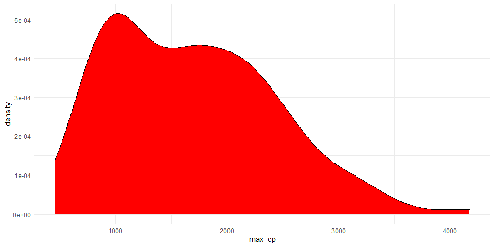<!-- -->

``` r
ggplot(data = pg04, aes(max_hp)) + geom_density(kernel = "gaussian", 
    fill = "red") + theme_minimal()
```

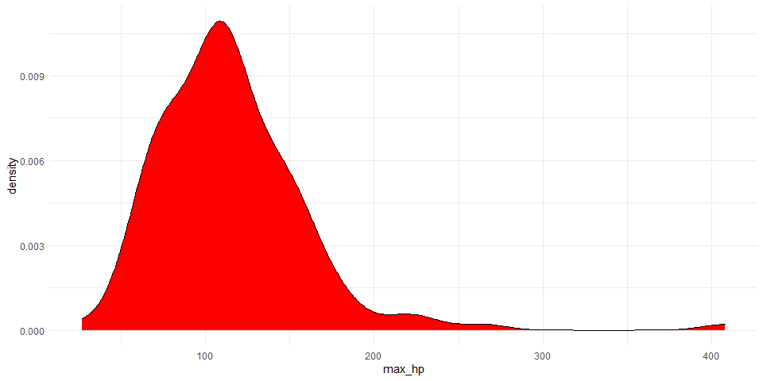<!-- -->

``` r
ggplot(data = pg04, aes(weave_dps)) + geom_density(kernel = "gaussian", 
    fill = "red") + theme_minimal()
```

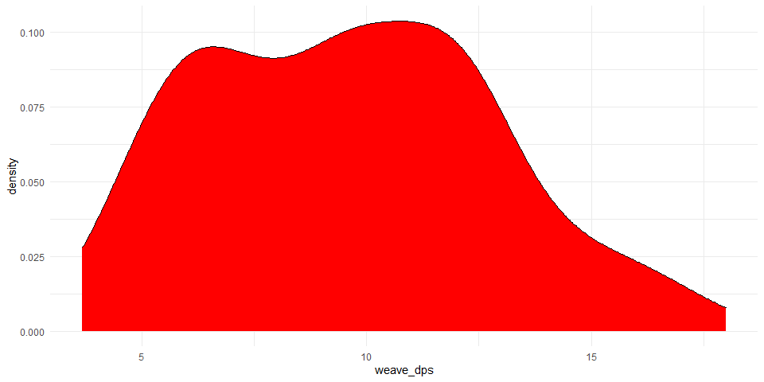<!-- -->

``` r
ggplot(data = pg04, aes(tdo)) + geom_density(kernel = "gaussian", 
    fill = "red") + theme_minimal()
```

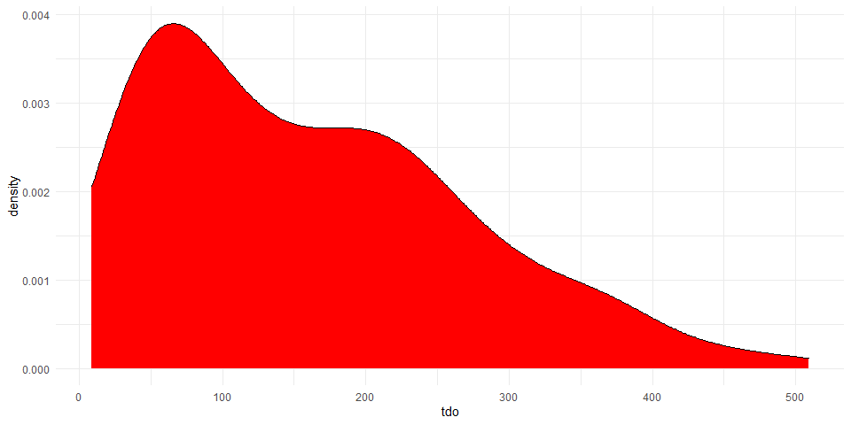<!-- -->

``` r
ggplot(data = pg04, aes(tdo_cp)) + geom_density(kernel = "gaussian", 
    fill = "red") + theme_minimal()
```

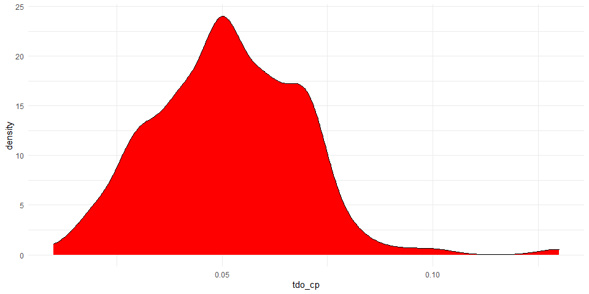<!-- -->

``` r
ggplot(data = pg04, aes(surv_time)) + geom_density(kernel = "gaussian", 
    fill = "red") + theme_minimal()
```

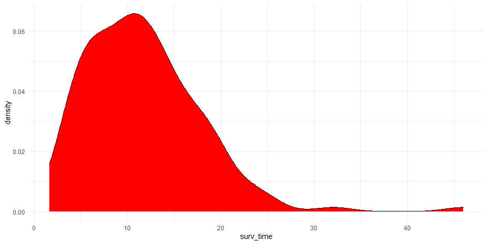<!-- -->

``` r
# ----- explore KPI distributions by first type -----
ggplot(data = pg04, aes(x = typ1, y = max_cp)) + 
    geom_violin(trim = FALSE, fill = "green") + 
    stat_summary(fun.data = mean_sdl, geom = "pointrange", color = "red") + 
    theme_minimal()
```

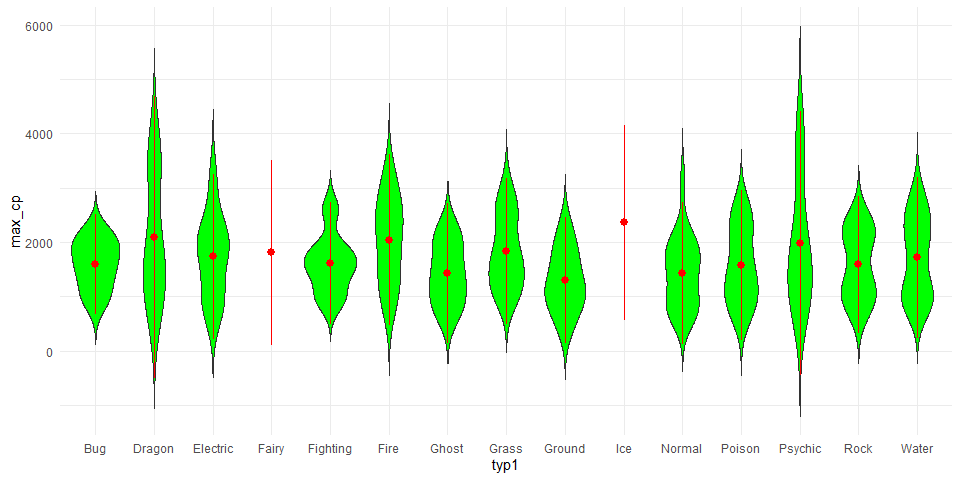<!-- -->

``` r
ggplot(data = pg04, aes(x = typ1, y = max_hp)) + 
    geom_violin(trim = FALSE, fill = "green") + 
    stat_summary(fun.data = mean_sdl, geom = "pointrange", color = "red") + 
    theme_minimal()
```

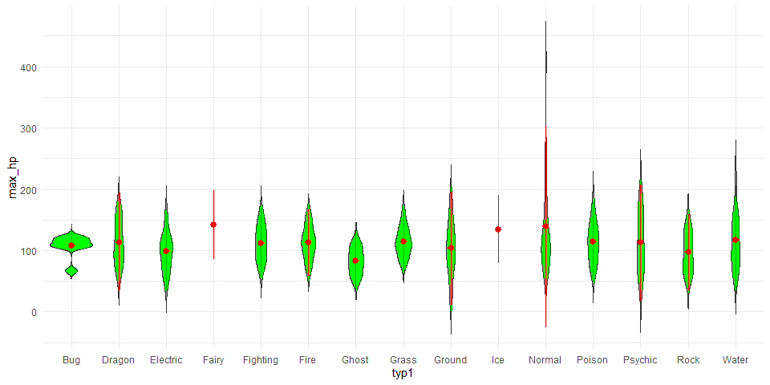<!-- -->

``` r
ggplot(data = pg04, aes(x = typ1, y = weave_dps)) + 
    geom_violin(trim = FALSE, fill = "green") + 
    stat_summary(fun.data = mean_sdl, geom = "pointrange", color = "red") + 
    theme_minimal()
```

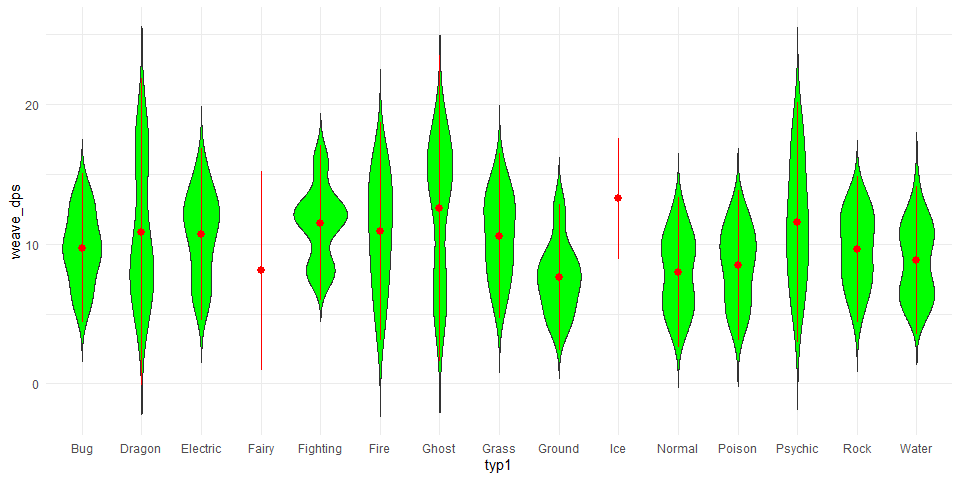<!-- -->

``` r
ggplot(data = pg04, aes(x = typ1, y = tdo)) + 
    geom_violin(trim = FALSE, fill = "green") + 
    stat_summary(fun.data = mean_sdl, geom = "pointrange", color = "red") + 
    theme_minimal()
```

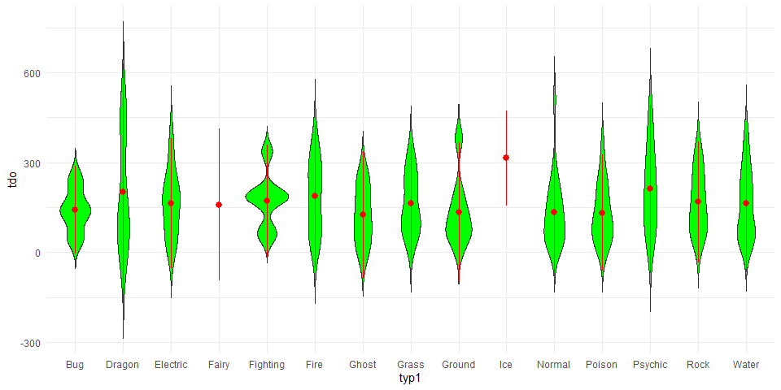<!-- -->

``` r
ggplot(data = pg04, aes(x = typ1, y = tdo_cp)) + 
    geom_violin(trim = FALSE, fill = "green") + 
    stat_summary(fun.data = mean_sdl, geom = "pointrange", color = "red") + 
    theme_minimal()
```

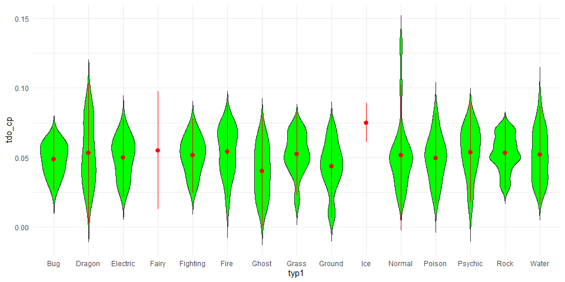<!-- -->

``` r
ggplot(data = pg04, aes(x = typ1, y = surv_time)) + 
    geom_violin(trim = FALSE, fill = "green") + 
    stat_summary(fun.data = mean_sdl, geom = "pointrange", color = "red") + 
    theme_minimal()
```

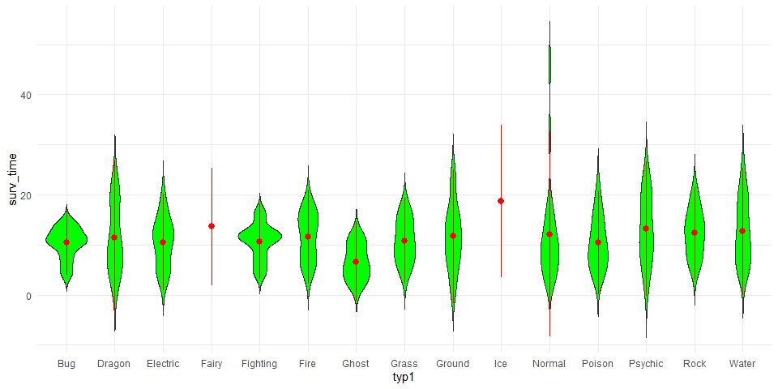<!-- -->

``` r
# ----- explore KPI distributions by second type (if available) -----
ggplot(data = pg04, aes(x = typ2, y = max_cp)) + 
    geom_violin(trim = FALSE, fill = "green") + 
    stat_summary(fun.data = mean_sdl, geom = "pointrange", color = "red") + 
    theme_minimal()
```

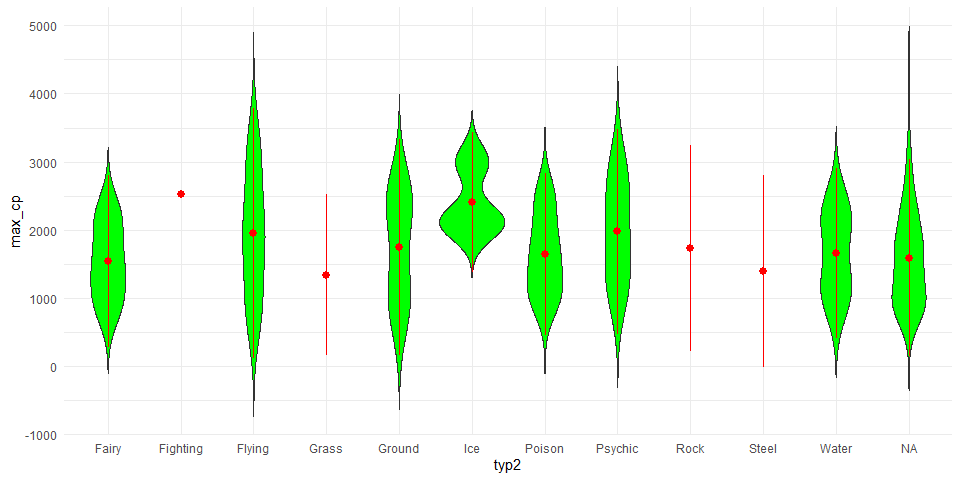<!-- -->

``` r
ggplot(data = pg04, aes(x = typ2, y = max_hp)) + 
    geom_violin(trim = FALSE, fill = "green") + 
    stat_summary(fun.data = mean_sdl, geom = "pointrange", color = "red") + 
    theme_minimal()
```

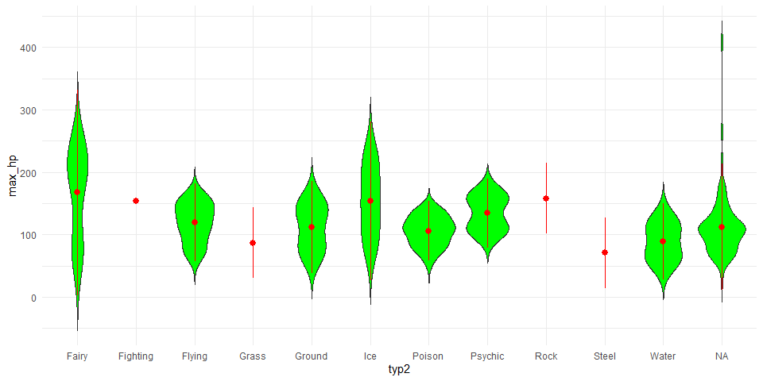<!-- -->

``` r
ggplot(data = pg04, aes(x = typ2, y = weave_dps)) + 
    geom_violin(trim = FALSE, fill = "green") + 
    stat_summary(fun.data = mean_sdl, geom = "pointrange", color = "red") + 
    theme_minimal()
```

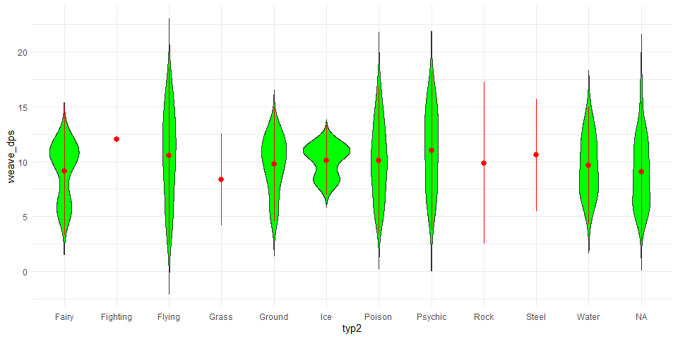<!-- -->

``` r
ggplot(data = pg04, aes(x = typ2, y = tdo)) + 
    geom_violin(trim = FALSE, fill = "green") + 
    stat_summary(fun.data = mean_sdl, geom = "pointrange", color = "red") + 
    theme_minimal()
```

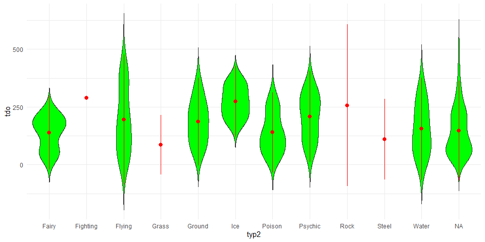<!-- -->

``` r
ggplot(data = pg04, aes(x = typ2, y = tdo_cp)) + 
    geom_violin(trim = FALSE, fill = "green") + 
    stat_summary(fun.data = mean_sdl, geom = "pointrange", color = "red") + 
    theme_minimal()
```

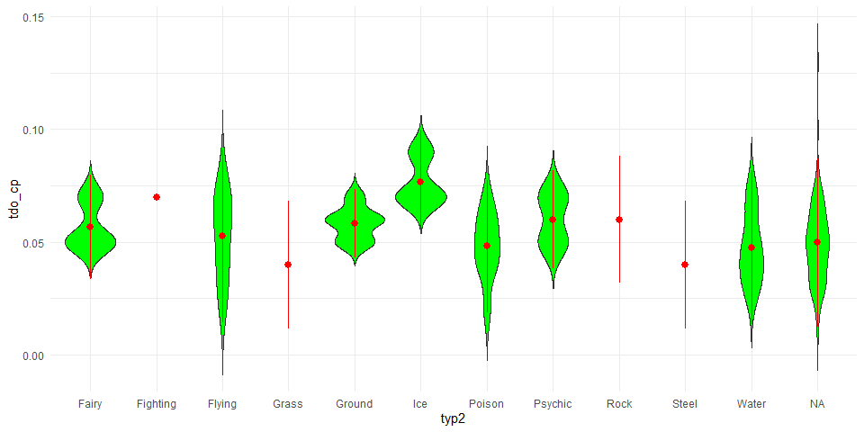<!-- -->

``` r
ggplot(data = pg04, aes(x = typ2, y = surv_time)) + 
    geom_violin(trim = FALSE, fill = "green") + 
    stat_summary(fun.data = mean_sdl, geom = "pointrange", color = "red") + 
    theme_minimal()
```

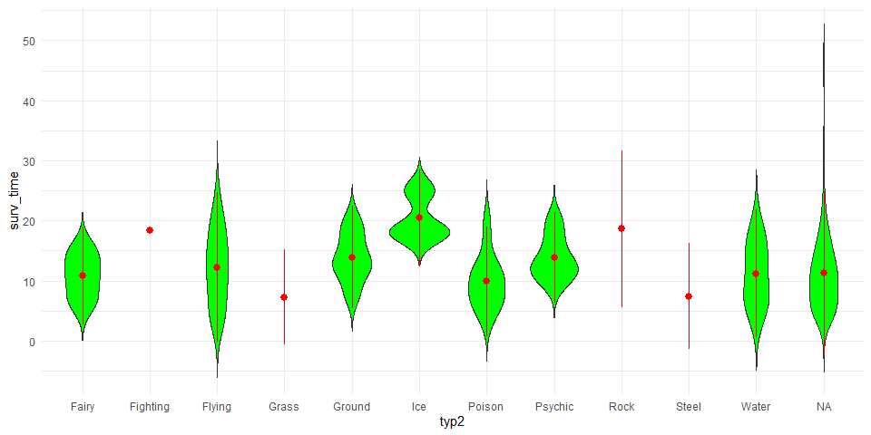<!-- -->

``` r
# ----- explore two-way KPI distributions and correlations -----
ggpairs(pg04, columns = 5:10, aes(alpha = 0.1), upper = list("cor")) + 
    theme_minimal()  # drop dps, tdo, tdo_cp b/c of high corr
```

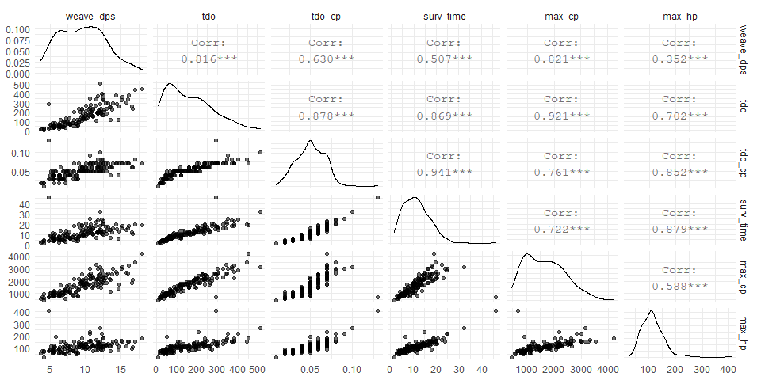<!-- -->

From the exploratory data analysis, several insights were generated:

  - All KPI’s were positively, right-skewed, signifying that there were
    a few prized species over the larger core group of species, at least
    univariately.
  - Dragon and Psychic types had the most varied max CP.
  - Max HP had less variance overall then max CP; however, Normal types
    had a significant max HP variance.
  - Normal type had the largest variance, by far, in terms of survival
    time.
  - As expected, all KPI’s had high positive correlation. In fact, some
    KPI’s were products of others (TDO = DPS \* Survival time, TDO per
    CP = TDO / CP).

## Feature Selection

There was no “tried and true” feature selection algorithms for
unsupervised machine learning, as opposed to supervised learning (e.g.,
elastic net, recursive feature elimation). I leveraged the correlation
plot as well as subject-matter expertise as an avid player. Since DPS,
TDO and TDO per CP had the highest correlations, I dropped these in
favour of the more preferred KPI’s of max CP, max HP and survival time
(preferred by a suspected majority of players).

As well, I kept all type 1 and type 2 classifications as dummy features.

``` r
# ----- select variables for clustering -----
pg05 <- as.data.frame(pg04) %>%
    select(starts_with("typ_"), max_cp, max_hp, surv_time)
# as the correlation plot showed, dps, tdo, tdo_cp was dropped due to high corr
# daisy function doesn't like tibbles
```

## Data Preparation for Clustering

As data for clustering required distances or simmiliarities, I
calculated the Gower distances between each Pokemon species
(asymmetrically for the type dummy features and log-ratio for the max
CP, max HP and survival time KPI’s).

``` r
# ----- transform by calculating Gower distances with mixed data types -----
pg06_dist <- daisy(pg05, metric = "gower", type = list(
    asymm = 
        c("typ_bug", "typ_dragon", "typ_electric", "typ_fairy", "typ_fighting",
            "typ_fire", "typ_ghost", "typ_grass", "typ_ground", "typ_ice",
            "typ_normal", "typ_poison", "typ_psychic", "typ_rock", "typ_water",
            "typ_flying", "typ_steel"),
    logratio = c("max_cp", "max_hp", "surv_time")))
summary(pg06_dist)
```

    ## 10440 dissimilarities, summarized :
    ##     Min.  1st Qu.   Median     Mean  3rd Qu.     Max. 
    ## 0.002128 0.468950 0.554850 0.533150 0.620810 0.920690 
    ## Metric :  mixed ;  Types = A, A, A, A, A, A, A, A, A, A, A, A, A, A, A, A, A, I, I, I 
    ## Number of objects : 145

## Model Hyperparameter Tuning

A popular method for hyperparameter tuning for DBSCAN was using a
k-nearest neighbour plot and varying k for the minimum number of members
in a cluster and interpretting the plots for an elbow point for a
hypothetical radius parameter. Using subject-matter expertise (e.g.,
high number of species, size of Pokemon box, relatively few species of
legendary/mythical status), I only included 1-2 as the minimum number of
species per cluster. I noted elbow points at radius parameters of 0.09
and 0.24 for k = 1, and 0.27 and 0.36 for k = 2, and these combinations
formed my tuning grid.

``` r
# ----- tune hyperparameters for dbscan clustering -----
dbscan::kNNdistplot(pg06_dist, k = 1)
abline(h = 0.09, lty = 2)  
```

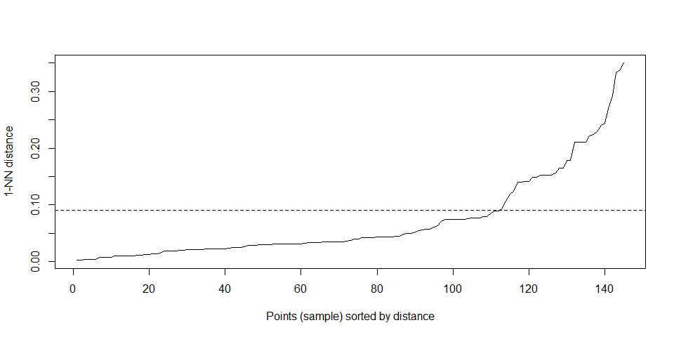<!-- -->

``` r
dbscan::kNNdistplot(pg06_dist, k = 1)
abline(h = 0.24, lty = 2)  
```

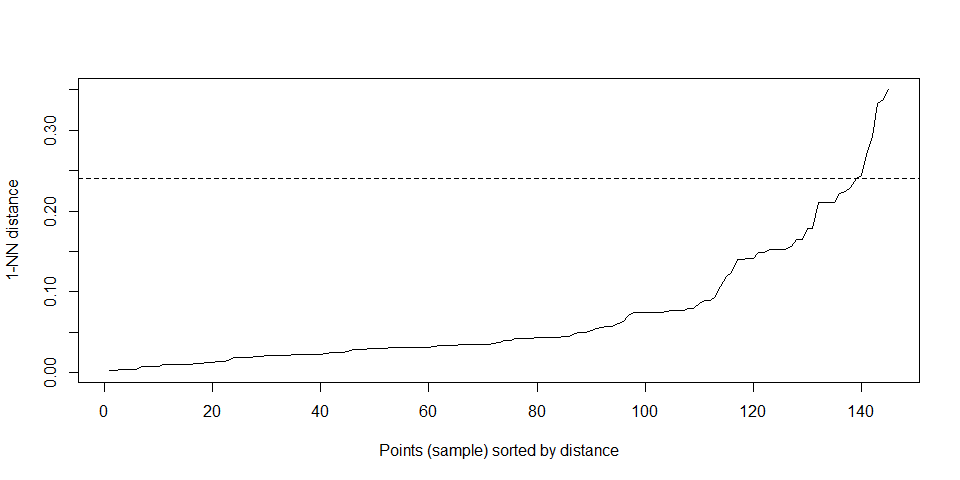<!-- -->

``` r
dbscan::kNNdistplot(pg06_dist, k = 2)
abline(h = 0.27, lty = 2)  
```

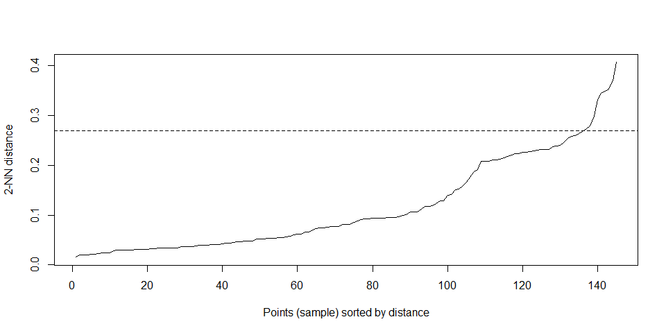<!-- -->

``` r
dbscan::kNNdistplot(pg06_dist, k = 2)
abline(h = 0.36, lty = 2)  
```

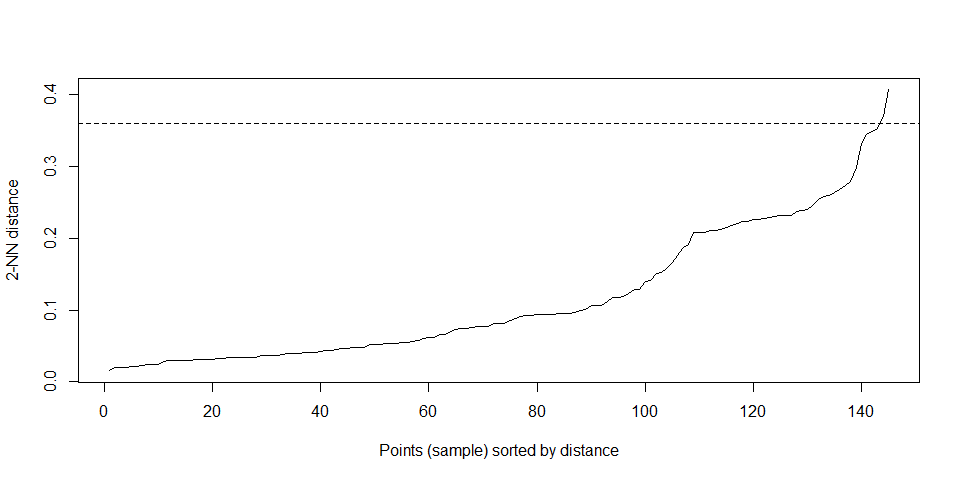<!-- -->

## Model Development Using DBSCAN for Clustering

I developed DBSCAN models across all 4 combinations in my tuning grid.
To be concise, I only included the code and results for the final model
below (hyperparameters of radius and minimum number of members of 0.24
and 1, respectively).

As the results showed, the final created 98 clusters ranging from 1
through 5 species within each cluster. Interpretting the cluster plot,
the centroids were not dispersed uniformly across the first 2 principal
components. This suggested that the game developers were strategic in
creating the species and their characteristics.

``` r
# ----- conduct dbscan clustering -----
pg07_dbs <- fpc::dbscan(pg06_dist, eps = 0.24, MinPts = 1)
fviz_cluster(pg07_dbs, data = pg06_dist, stand = TRUE, ellipse = TRUE, 
    show.clust.cent = TRUE, palette = "paired", geom = "point", pointsize = 1,
    repel = TRUE, ggtheme = theme_minimal()) + coord_fixed()
```

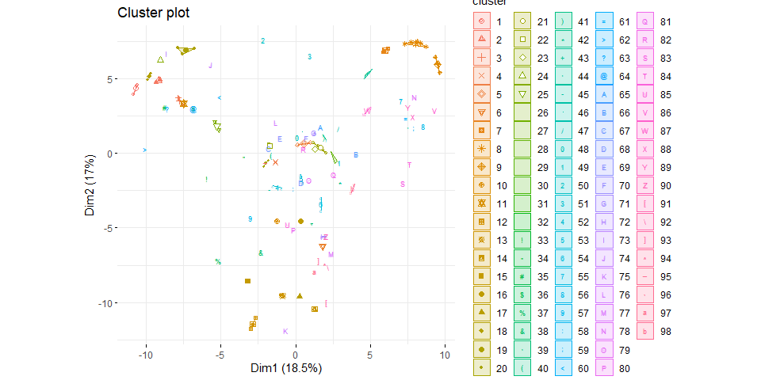<!-- -->

``` r
# ----- tabulate member results -----
pg08_clus <- as_tibble(pg07_dbs$cluster) %>%
    bind_cols(pg04) %>%
    rename(cluster = value)
table(pg08_clus$cluster)
```

    ## 
    ##  1  2  3  4  5  6  7  8  9 10 11 12 13 14 15 16 17 18 19 20 21 22 23 24 25 26 
    ##  3  3  3  2  3  1  3  5  3  1  1  3  2  1  1  1  2  2  4  2  4  2  1  1  2  1 
    ## 27 28 29 30 31 32 33 34 35 36 37 38 39 40 41 42 43 44 45 46 47 48 49 50 51 52 
    ##  1  4  1  1  1  1  1  1  1  1  1  1  2  1  2  1  5  1  1  1  1  1  1  1  1  2 
    ## 53 54 55 56 57 58 59 60 61 62 63 64 65 66 67 68 69 70 71 72 73 74 75 76 77 78 
    ##  2  2  1  1  1  1  1  1  1  1  1  1  1  1  1  1  1  1  2  2  1  1  1  1  1  1 
    ## 79 80 81 82 83 84 85 86 87 88 89 90 91 92 93 94 95 96 97 98 
    ##  1  1  1  1  1  1  1  1  2  1  1  1  1  1  1  1  1  1  1  2

## Investigation of Model Results

As noted above, the cluster centroids did not appear to be randomly
dispersed in the cluster plot. One particular pattern noticed was in the
upper right of the plot, where clusters 43, 9, 8 and 7 seemed to form a
parabolic shape. Wrangling the data uncovered the specific species (from
lower left of parabola to upper right):

  - Cluster \#43: Horsea, Krabby, Poliwag, Shellder, Staryu
  - Cluster \#9: Blastoise, Golduck, Seaking
  - Cluster \#8: Kingler, Poliwhirl, Seadra, Seel, Wartortle
  - Cluster \#7: Goldeen, Psyduck, Squirtle

As an avid player, I could not mentally deduce the reasons or developer
strategy (if any) for the parabolic shape.

``` r
# ----- investigate parabolic cluster pattern in upper right of scatter -----
tmp <- pg08_clus %>%
    select(cluster, name) %>%
    filter(cluster %in% c(43, 9, 8, 7)) %>%
    mutate(order = ifelse(cluster == 43, 1,
        ifelse(cluster == 9, 2, 
            ifelse(cluster == 8, 3, 4)))) %>%
    arrange(order, name)
```

## Summary of Results

As a player, many of the species were clustered in expected ways (e.g.,
Spearow and Pidgey being in the same cluster). However, some results
were unexpected, such as Onix and Geodude being in the same cluster.

There was also a large number of clusters, and no 1-2 dominant clusters
in terms of size. This was atypical of many clustering analyses, and
suggested a large variance in Pokemon species and likely intentional
game development strategies. In fact, the Pokemon catch phrase “Gotta
Catch ’Em All” was quite appropriate, though the final model showed a
more truthful phrase might be “Gotta Catch Most of ’Em All”.

In the absence of all other information, the model suggested that the
full set of Pokemon species could be reduced through redundancy by 32%
(i.e., (145 species - 98 clusters) / 145 species). For example, a player
could develop a playing strategy where he/she keeps a single species in
a particular cluster, while discarding the other species in the same
cluster.

A detailed model summary, showing all species analyed with their cluster
membership, was provided at the end.

## Conclusion

This model should be used as a starting point to identify redundancy,
combined with player expertise and possibly refined with more data in
order to make optimal keep/discard decisions. Again in the absence of
all other information, such as playing experience, avid player advice or
online research, the model suggested that a player could be successful
in discarding 32% of Pokemon species without a detrimental loss in
Pokemon box capabilities.

## Detailed Summary of Results

Below was the detailed summary of results, outlining all species
analyzed with their cluster membership.

``` r
# ----- print final model results -----
tmp <- pg08_clus %>%
    select(cluster, pm_nbr, name) %>%
    arrange(cluster, pm_nbr, name)
print(as.data.frame(tmp))
```

    ##     cluster pm_nbr            name
    ## 1         1    001       Bulbasaur
    ## 2         1    043          Oddish
    ## 3         1    069      Bellsprout
    ## 4         2    002         Ivysaur
    ## 5         2    044           Gloom
    ## 6         2    070      Weepinbell
    ## 7         3    003        Venusaur
    ## 8         3    045       Vileplume
    ## 9         3    071      Victreebel
    ## 10        4    004      Charmander
    ## 11        4    037          Vulpix
    ## 12        5    005      Charmeleon
    ## 13        5    058       Growlithe
    ## 14        5    077          Ponyta
    ## 15        6    006       Charizard
    ## 16        7    007        Squirtle
    ## 17        7    054         Psyduck
    ## 18        7    118         Goldeen
    ## 19        8    008       Wartortle
    ## 20        8    061       Poliwhirl
    ## 21        8    086            Seel
    ## 22        8    099         Kingler
    ## 23        8    117          Seadra
    ## 24        9    009       Blastoise
    ## 25        9    055         Golduck
    ## 26        9    119         Seaking
    ## 27       10    012      Butterfree
    ## 28       11    015        Beedrill
    ## 29       12    016          Pidgey
    ## 30       12    021         Spearow
    ## 31       12    084           Doduo
    ## 32       13    017       Pidgeotto
    ## 33       13    083      Farfetch'd
    ## 34       14    018         Pidgeot
    ## 35       15    019         Rattata
    ## 36       16    020        Raticate
    ## 37       17    022          Fearow
    ## 38       17    085          Dodrio
    ## 39       18    023           Ekans
    ## 40       18    032 Nidoran<U+2642>
    ## 41       19    024           Arbok
    ## 42       19    030        Nidorina
    ## 43       19    033        Nidorino
    ## 44       19    088          Grimer
    ## 45       20    025         Pikachu
    ## 46       20    100         Voltorb
    ## 47       21    026          Raichu
    ## 48       21    101       Electrode
    ## 49       21    125      Electabuzz
    ## 50       21    135         Jolteon
    ## 51       22    027       Sandshrew
    ## 52       22    051         Dugtrio
    ## 53       23    028       Sandslash
    ## 54       24    029 Nidoran<U+2640>
    ## 55       25    031       Nidoqueen
    ## 56       25    034        Nidoking
    ## 57       26    035        Clefairy
    ## 58       27    036        Clefable
    ## 59       28    038       Ninetales
    ## 60       28    078        Rapidash
    ## 61       28    126          Magmar
    ## 62       28    136         Flareon
    ## 63       29    039      Jigglypuff
    ## 64       30    040      Wigglytuff
    ## 65       31    041           Zubat
    ## 66       32    042          Golbat
    ## 67       33    046           Paras
    ## 68       34    047        Parasect
    ## 69       35    048         Venonat
    ## 70       36    049        Venomoth
    ## 71       37    050         Diglett
    ## 72       38    052          Meowth
    ## 73       39    053         Persian
    ## 74       39    137         Porygon
    ## 75       40    056          Mankey
    ## 76       41    057        Primeape
    ## 77       41    067         Machoke
    ## 78       42    059        Arcanine
    ## 79       43    060         Poliwag
    ## 80       43    090        Shellder
    ## 81       43    098          Krabby
    ## 82       43    116          Horsea
    ## 83       43    120          Staryu
    ## 84       44    062       Poliwrath
    ## 85       45    063            Abra
    ## 86       46    064         Kadabra
    ## 87       47    065        Alakazam
    ## 88       48    066          Machop
    ## 89       49    068         Machamp
    ## 90       50    072       Tentacool
    ## 91       51    073      Tentacruel
    ## 92       52    074         Geodude
    ## 93       52    095            Onix
    ## 94       53    075        Graveler
    ## 95       53    111         Rhyhorn
    ## 96       54    076           Golem
    ## 97       54    112          Rhydon
    ## 98       55    079        Slowpoke
    ## 99       56    080         Slowbro
    ## 100      57    081       Magnemite
    ## 101      58    082        Magneton
    ## 102      59    087         Dewgong
    ## 103      60    089             Muk
    ## 104      61    091        Cloyster
    ## 105      62    092          Gastly
    ## 106      63    093         Haunter
    ## 107      64    094          Gengar
    ## 108      65    096         Drowzee
    ## 109      66    097           Hypno
    ## 110      67    102       Exeggcute
    ## 111      68    103       Exeggutor
    ## 112      69    104          Cubone
    ## 113      70    105         Marowak
    ## 114      71    106       Hitmonlee
    ## 115      71    107      Hitmonchan
    ## 116      72    108       Lickitung
    ## 117      72    128          Tauros
    ## 118      73    109         Koffing
    ## 119      74    110         Weezing
    ## 120      75    113         Chansey
    ## 121      76    114         Tangela
    ## 122      77    115      Kangaskhan
    ## 123      78    121         Starmie
    ## 124      79    122        Mr. Mime
    ## 125      80    123         Scyther
    ## 126      81    124            Jynx
    ## 127      82    127          Pinsir
    ## 128      83    130        Gyarados
    ## 129      84    131          Lapras
    ## 130      85    133           Eevee
    ## 131      86    134        Vaporeon
    ## 132      87    138         Omanyte
    ## 133      87    140          Kabuto
    ## 134      88    139         Omastar
    ## 135      89    141        Kabutops
    ## 136      90    142      Aerodactyl
    ## 137      91    143         Snorlax
    ## 138      92    144        Articuno
    ## 139      93    145          Zapdos
    ## 140      94    146         Moltres
    ## 141      95    147         Dratini
    ## 142      96    148       Dragonair
    ## 143      97    149       Dragonite
    ## 144      98    150          Mewtwo
    ## 145      98    151             Mew
